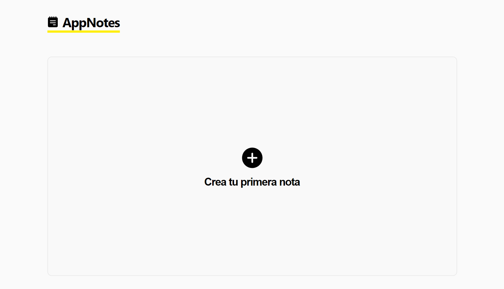
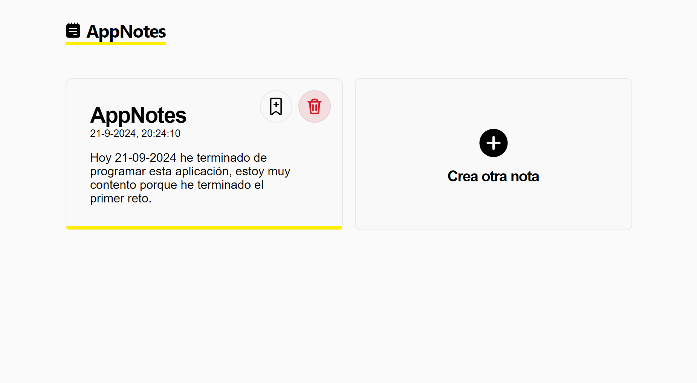

# Bienvenido al reto de 100 días 🎯

Este tratará de realizar **10 proyectos** hasta el final del año 2024 (100 días aprox). Se usará principalmente HTML, CSS y JavaScript, aunque no cabe duda que habrán mucho más lenguajes y
tecnologías.

## Proyectos ❤️

| #   | Proyecto     | Descripción                                  | Código                                                                          | Enlace                          |
| --- | ------------ | -------------------------------------------- | ------------------------------------------------------------------------------- | ------------------------------- |
| 01  | **AppNotes** | Crea, etiqueta, elimina y organiza tus notas | [/01-appnotes](https://github.com/jevmydev/reto-100-dias/tree/main/01-appnotes) | https://01-appnotes.netlify.app |

## 01 - AppNotes 📓

El proyecto 01 es "AppNotes", una aplicación simple para crear y organizar notas.

👉 Enlace: https://01-appnotes.netlify.app/   🧑‍💻 Código: [/01-appnotes](https://github.com/jevmydev/reto-100-dias/tree/main/01-appnotes)

 

### Rework ⭐

Se que he estado desaparecido de este mundillo por mucho tiempo, pero no es tiempo de contarte por qué, sino que es tiempo de programar y volver mucho más fuerte. Y que mejor que empezar por este
reto...

Solo dejame decirte que **esto significa mucho para mí**
