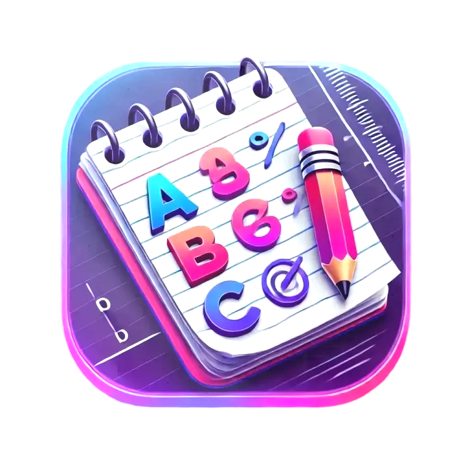
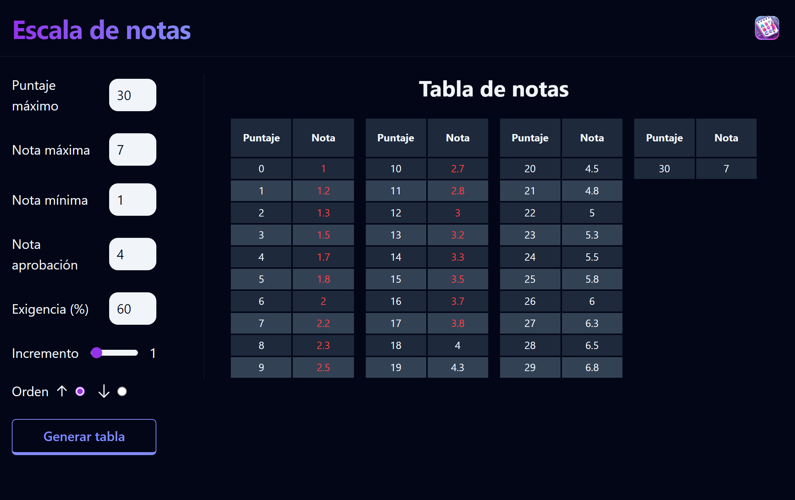
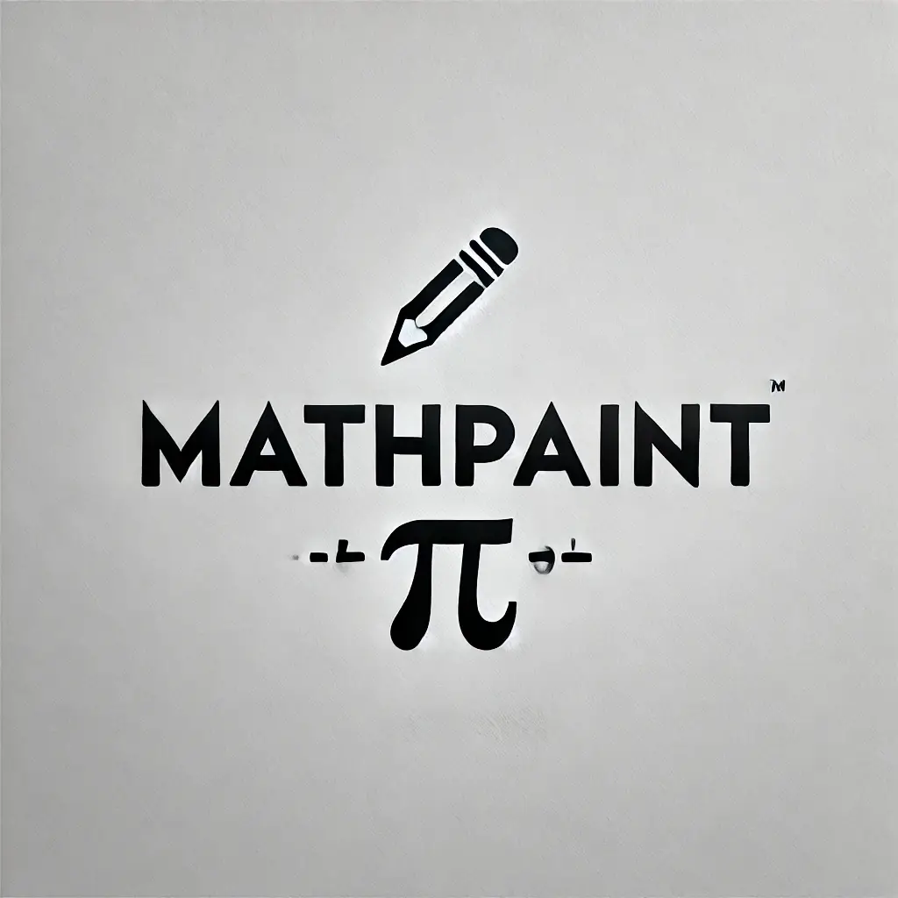
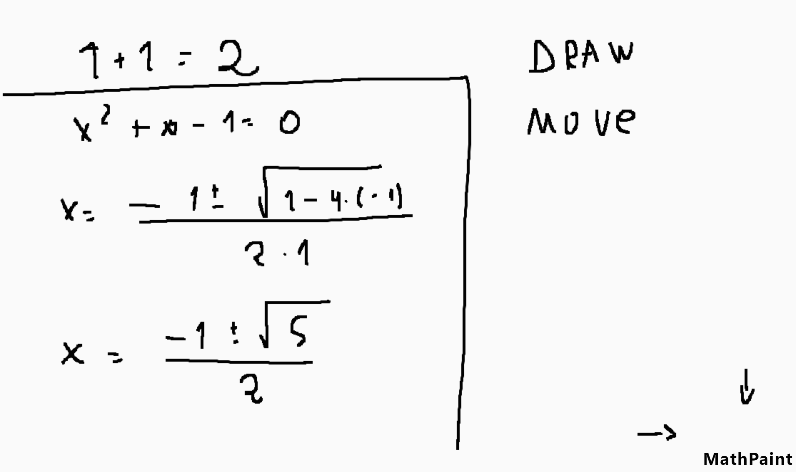
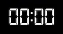
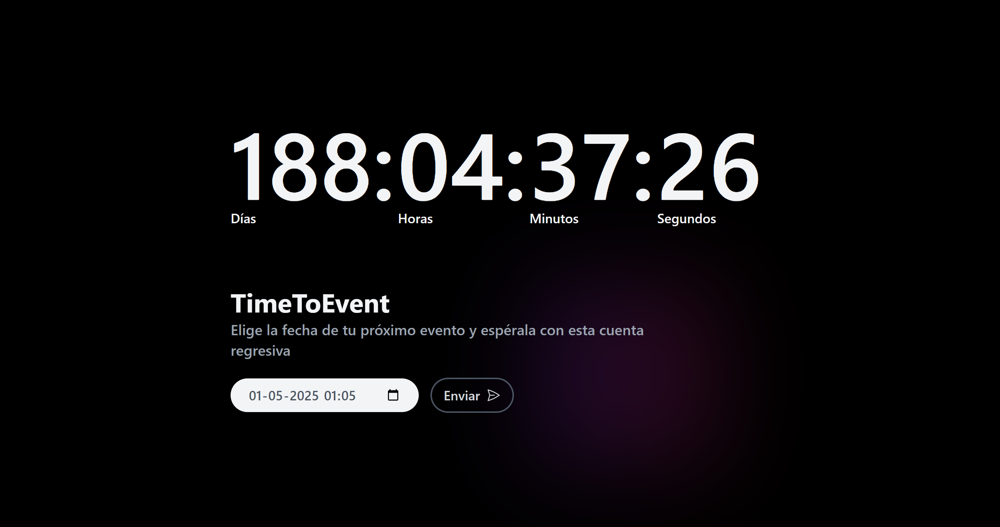

# Bienvenido al reto de 100 días 🎯

Este tratará de realizar **10 proyectos** hasta el final del año 2024 (100 días aprox). Se usará principalmente HTML, CSS y JavaScript, aunque no cabe duda que habrán mucho más lenguajes y
tecnologías.

## Proyectos ❤️

| #   | Proyecto            | Descripción                                    | Código                                                                                        | Enlace                               |
| --- | ------------------- | ---------------------------------------------- | --------------------------------------------------------------------------------------------- | ------------------------------------ |
| 01  | **AppNotes**        | Crea, etiqueta, elimina y organiza tus notas   | [/01-appnotes](https://github.com/jevmydev/reto-100-dias/tree/main/01-appnotes)               | https://theappnotes.netlify.app      |
| 02  | **Escala de notas** | Escala notas, calcula tus promedios y más      | [/02-escala-de-notas](https://github.com/jevmydev/reto-100-dias/tree/main/02-escala-de-notas) | https://escala-de-notas.netlify.app/ |
| 03  | **Mathpaint**       | Dibuja en toda la web tus cálculos matemáticos | [/03-mathpaint](https://github.com/jevmydev/reto-100-dias/tree/main/03-mathpaint)             | https://mathpaint.netlify.app/       |
| 04  | **TimeToEvent**     | Contador regresivo hasta tu fecha de tu evento | [/04-timetoevent](https://github.com/jevmydev/reto-100-dias/tree/main/04-timetoevent)         | https://timetoevent.netlify.app/     |

## 01 - AppNotes 📓

El proyecto 01 es "AppNotes", una aplicación simple para crear y organizar notas.

👉 Enlace: https://theappnotes.netlify.app/   🧑‍💻 Código: [/01-appnotes](https://github.com/jevmydev/reto-100-dias/tree/main/01-appnotes)

 

## 02 - Escala de notas 📓+

El proyecto 02 es "Escala de notas", donde podemos calcular escalas, ver una tabla de calificaciones y avanzar académicamente.

👉 Enlace: https://escala-de-notas.netlify.app/   🧑‍💻 Código: [/02-escala-de-notas](https://github.com/jevmydev/reto-100-dias/tree/main/02-escala-de-notas)

 

## 03 - MathPaint ✍️🔢

El proyecto 03 es "MathPaint", un sitio donde puedes dibujar en toda la web tus cálculos matemáticos.

👉 Enlace: https://mathpaint.netlify.app/   🧑‍💻 Código: [/03-mathpaint](https://github.com/jevmydev/reto-100-dias/tree/main/03-mathpaint)

 

## 04 - TimeToEvent ⌚

El proyecto 04 es "TimeToEvent", tu generador favorito de contador de tiempo hasta llegar a la fecha de tu evento especial

👉 Enlace: https://timetoevent.netlify.app/   🧑‍💻 Código: [/04-timetoevent](https://github.com/jevmydev/reto-100-dias/tree/main/04-timetoevent)

 

### Rework ⭐

Se que he estado desaparecido de este mundillo por mucho tiempo, pero no es tiempo de contarte por qué, sino que es tiempo de programar y volver mucho más fuerte. Y que mejor que empezar por este
reto...

Solo dejame decirte que **esto significa mucho para mí**
