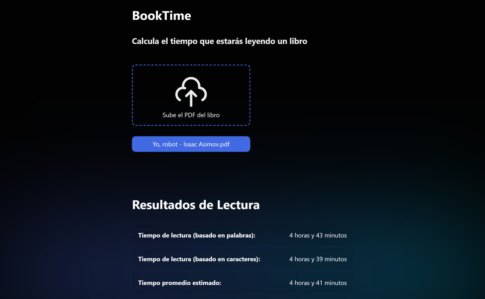
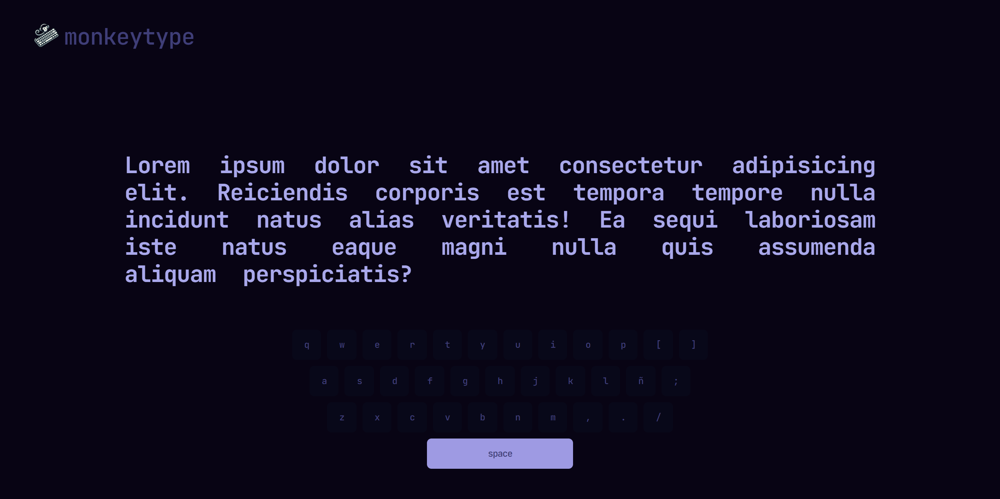
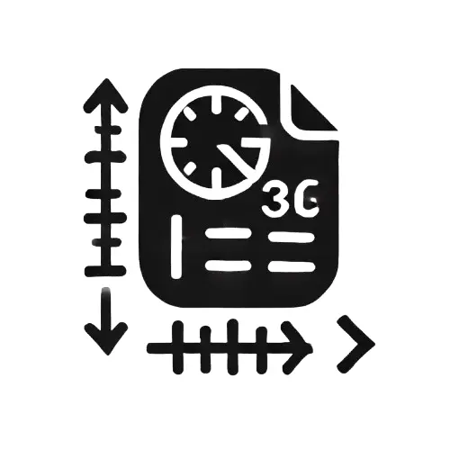
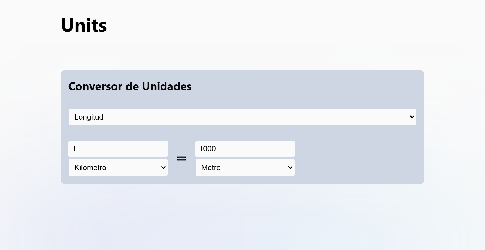

# Bienvenido al reto de 100 días 🎯

Este tratará de realizar **10 proyectos** hasta el final del año 2024 (100 días aprox). Se usará principalmente HTML, CSS y JavaScript, aunque no cabe duda que habrán mucho más lenguajes y
tecnologías.

## Proyectos ❤️

| #   | Proyecto            | Descripción                                    | Código                                                                                        | Enlace                               |
| --- | ------------------- | ---------------------------------------------- | --------------------------------------------------------------------------------------------- | ------------------------------------ |
| 01  | **AppNotes**        | Crea, etiqueta, elimina y organiza tus notas   | [/01-appnotes](https://github.com/jevmydev/reto-100-dias/tree/main/01-appnotes)               | https://theappnotes.netlify.app      |
| 02  | **Escala de notas** | Escala notas, calcula tus promedios y más      | [/02-escala-de-notas](https://github.com/jevmydev/reto-100-dias/tree/main/02-escala-de-notas) | https://escala-de-notas.netlify.app/ |
| 03  | **Mathpaint**       | Dibuja en toda la web tus cálculos matemáticos | [/03-mathpaint](https://github.com/jevmydev/reto-100-dias/tree/main/03-mathpaint)             | https://mathpaint.netlify.app/       |
| 04  | **TimeToEvent**     | Contador regresivo hasta tu fecha de tu evento | [/04-timetoevent](https://github.com/jevmydev/reto-100-dias/tree/main/04-timetoevent)         | https://timetoevent.netlify.app/     |
| 05  | **BookTime**        | Calcula el tiempo que estarás leyendo un libro | [/05-booktime](https://github.com/jevmydev/reto-100-dias/tree/main/05-booktime)               | https://thebooktime.netlify.app/     |
| 06  | **MonkeyType**      | Pon a prueba tu mecanografía en este juego     | [/06-monkeytype](https://github.com/jevmydev/reto-100-dias/tree/main/06-monkeytype)           | https://themonkeytype.netlify.app/   |
| 07  | **Tesla Clon**      | Página clon de Tesla con todos sus efectos     | [/07-tesla-clone](https://github.com/jevmydev/reto-100-dias/tree/main/07-tesla-clone)         | https://the-tesla-clon.netlify.app/  |
| 07  | **Units**           | Convierte unidades entre diversas medidas      | [/08-units](https://github.com/jevmydev/reto-100-dias/tree/main/08-units)                     | https://the-units.netlify.app/       |

## 01 - AppNotes 📓

El proyecto 01 es "AppNotes", una aplicación simple para crear y organizar notas.

👉 Enlace: https://theappnotes.netlify.app/   🧑‍💻 Código: [/01-appnotes](https://github.com/jevmydev/reto-100-dias/tree/main/01-appnotes)

 

## 02 - Escala de notas 📓+

El proyecto 02 es "Escala de notas", donde podemos calcular escalas, ver una tabla de calificaciones y avanzar académicamente.

👉 Enlace: https://escala-de-notas.netlify.app/   🧑‍💻 Código: [/02-escala-de-notas](https://github.com/jevmydev/reto-100-dias/tree/main/02-escala-de-notas)

 

## 03 - MathPaint ✍️🔢

El proyecto 03 es "MathPaint", un sitio donde puedes dibujar en toda la web tus cálculos matemáticos.

👉 Enlace: https://mathpaint.netlify.app/   🧑‍💻 Código: [/03-mathpaint](https://github.com/jevmydev/reto-100-dias/tree/main/03-mathpaint)

 

## 04 - TimeToEvent ⌚

El proyecto 04 es "TimeToEvent", tu generador favorito de contador de tiempo hasta llegar a la fecha de tu evento especial

👉 Enlace: https://timetoevent.netlify.app/   🧑‍💻 Código: [/04-timetoevent](https://github.com/jevmydev/reto-100-dias/tree/main/04-timetoevent)

 

## 05 - BookTime ⌚

El proyecto 05 es "BookTime", donde puedes calcular el tiempo que estarás leyendo un libro que te guste

👉 Enlace: https://thebooktime.netlify.app/   🧑‍💻 Código: [/05-booktime](https://github.com/jevmydev/reto-100-dias/tree/main/05-booktime)

 

## 06 - MonkeyType ⌨️

El proyecto 06 es "MonkeyType", un juego web donde pones a prueba tu mecanografía mientras mejoras tu velocidad y precisión de tipeo

👉 Enlace: https://themonkeytype.netlify.app/   🧑‍💻 Código: [/06-monkeytype](https://github.com/jevmydev/reto-100-dias/tree/main/06-monkeytype)

 

## 07 - Tesla Clon ⚡🚗

El proyecto 07 es "Tesla Clon", una clon de la página de Tesla para fines educativos. Realice los efectos, el responsive, hovers y la landing principal de la web.

👉 Enlace: https://the-tesla-clon.netlify.app/   🧑‍💻 Código: [/07-tesla-clone](https://github.com/jevmydev/reto-100-dias/tree/main/07-tesla-clone)

 

## 08 - Units 📏📐

El proyecto 08 es "Units", una aplicación que te permite convertir unidades entre diversas medidas.

👉 Enlace: https://the-units.netlify.app/   🧑‍💻 Código: [/08-units](https://github.com/jevmydev/reto-100-dias/tree/main/08-units)

 

### Rework ⭐

Se que he estado desaparecido de este mundillo por mucho tiempo, pero no es tiempo de contarte por qué, sino que es tiempo de programar y volver mucho más fuerte. Y que mejor que empezar por este
reto...

Solo dejame decirte que **esto significa mucho para mí**
